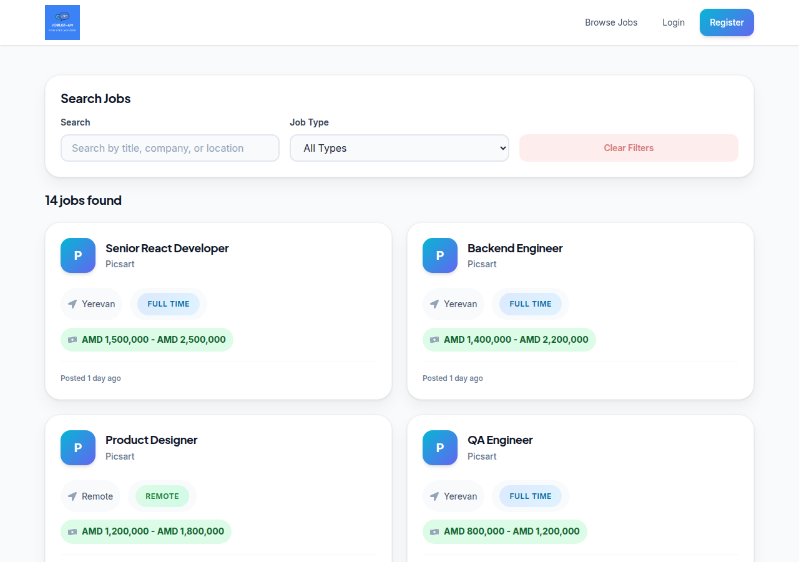
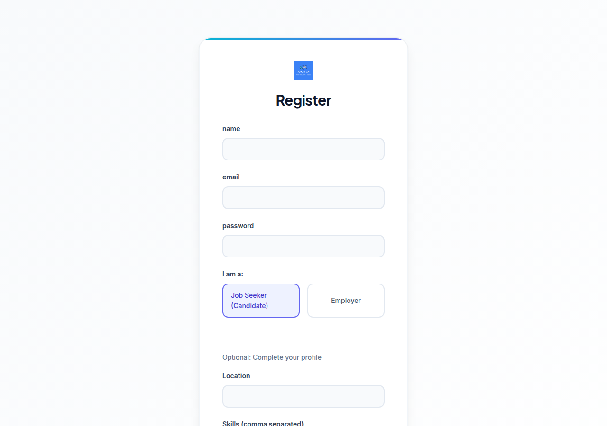
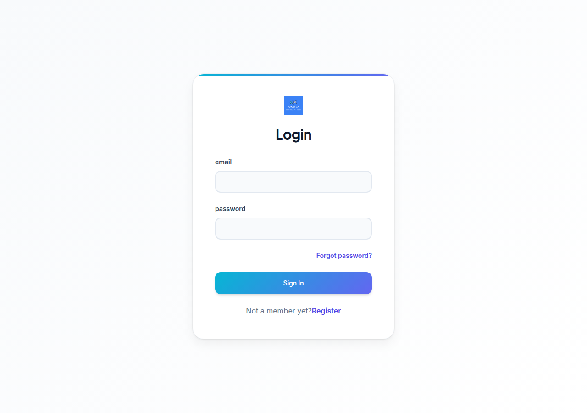
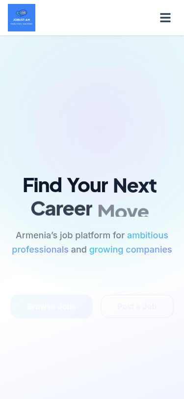
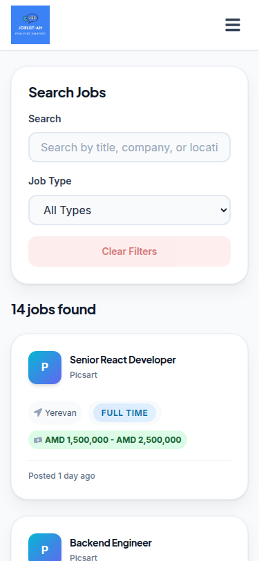

# JobList.am

A full-stack two-sided job marketplace connecting talented professionals with top Armenian employers. Candidates can browse jobs, apply instantly, and track applications. Employers can post openings and manage their hiring pipeline.

> Portfolio project demonstrating React + Redux Toolkit + Supabase with role-based authentication and Row Level Security.

**Live Demo:** [joblist-am.vercel.app](https://joblist-am.vercel.app) | **GitHub:** [github.com/AvetBadalyan/joblist-am](https://github.com/AvetBadalyan/joblist-am)

---

## Screenshots

### Desktop

| Homepage                                     | Browse Jobs                                        |
| -------------------------------------------- | -------------------------------------------------- |
|  |  |

| Register                                     | Login                                  |
| -------------------------------------------- | -------------------------------------- |
|  |  |

### Mobile

| Mobile Home                                            | Mobile Jobs                                        |
| ------------------------------------------------------ | -------------------------------------------------- |
|  |  |

> See the full app at [joblist-am.vercel.app](https://joblist-am.vercel.app)

---

## Features

### For Job Seekers (Candidates)

- **Browse Jobs** — Search and filter open positions by title, company, location, and job type
- **One-Click Apply** — Submit applications with cover letter and optional resume
- **Track Applications** — Monitor status through the hiring pipeline (Applied → Reviewing → Interview → Offer)
- **Save Jobs** — Bookmark interesting positions for later
- **Profile Management** — Update skills, location, and resume URL

### For Employers

- **Post Jobs** — Create listings with title, description, requirements, and salary range
- **Manage Listings** — Edit, close, or delete job postings
- **Review Applicants** — View cover letters and update application status
- **Company Profile** — Maintain company information across all postings

### Core Platform

- **Role-Based Auth** — Secure registration/login with Supabase Auth
- **Route Protection** — Candidates and employers see only relevant pages
- **Optimistic UI** — Bookmarks and applications update instantly, with rollback on failure
- **Responsive Design** — Mobile-first, works across all devices
- **Loading States** — Skeleton placeholders during data fetches

---

## Tech Stack

| Technology        | Purpose                    |
| ----------------- | -------------------------- |
| React 18          | UI framework               |
| Redux Toolkit     | Global state management    |
| Supabase          | Auth + PostgreSQL database |
| styled-components | Component-scoped CSS-in-JS |
| React Router v6   | Client-side routing        |
| React Toastify    | Toast notifications        |

---

## Local Setup

### Prerequisites

- Node.js 16+
- [Supabase](https://supabase.com) account (free tier works)

### 1. Clone and install

```bash
git clone https://github.com/AvetBadalyan/joblist-am.git
cd joblist-am
npm install
```

### 2. Configure environment

```bash
cp .env.example .env
```

Edit `.env` with your Supabase credentials (found in Supabase Dashboard → Settings → API):

```
REACT_APP_SUPABASE_URL=your_supabase_project_url
REACT_APP_SUPABASE_ANON_KEY=your_supabase_anon_key
```

### 3. Set up database

In Supabase SQL Editor, run migrations in order:

1. `db/001_profiles.sql`
2. `db/002_jobs.sql`
3. `db/003_applications.sql`
4. `db/004_saved_jobs.sql`

To load demo data (optional), first create the 5 demo users in **Authentication → Users**, then run `db/005_seed.sql`. See [`db/README.md`](db/README.md) for the exact emails and steps.

### 4. Start development server

```bash
npm start
```

App runs at [http://localhost:3000](http://localhost:3000)

---

## Project Structure

```
src/
├── Pages/              # Route-level components
│   ├── BrowseJobs/     # Public job listing
│   ├── JobDetail/      # Job details + apply form
│   ├── Candidate/      # Candidate dashboard, applications, saved jobs
│   └── Employer/       # Employer dashboard, post/edit jobs, view applicants
├── components/         # Reusable UI components
├── features/           # Redux slices and thunks
├── assets/wrappers/    # styled-components for each page/component
├── hooks/              # Custom React hooks
├── utils/              # Supabase client, helpers, mappers
└── data/               # Static data for landing page
db/                     # Database migrations (SQL files for Supabase)
```

---

## License

MIT
